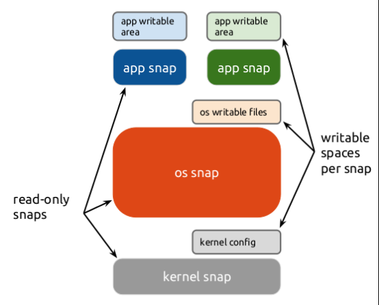

# snap技术调研报告

## 相关术语

|      缩写      | 全称 | 描述 |
| :------------: | :--: | :--: |
| Snap | Snap | 一种通用Linux软件包格式 |

## 问题
Linux应用打包有两大派系，rpm和deb。围绕rpm包格式，有yum包管理，dnf包管理。deb包格式有apt包管理，aptitude包管理。
包有版本，包和包之间有版本依赖，版本排斥，包安装可能失败，包卸载可能有残留，包升级可能有种种不测。这像极了一片沼泽地，稍不留意就会陷进去。

作为应用的开发者，当想为Linux桌面系统提供软件包的同时，需要将其分发到每一个发行版中，甚至需要为不同的发行版编译多个版本，极为不便。

## 现状
目前已有的技术为`docker`容器化技术，将应用打包为`docker`镜像进行分发。但仍然存在很多不便，比如需要本机拥有`docker`环境、需要学习如何简单使用`docker`容器。

另一种方案为使用`AppImage`打包技术，类似于`snap`技术，将所有的依赖进行打包，只需要一个打包，即可在其它发行版桌面上运行。但存在打包体积过大，且对于程序无法更好的管理及分发。


## 技术方案
此处介绍一种`Ubuntu`的一种技术方案，即`Snap`。`Snap`是一个软件打包和部署所开发的系统规范的操作系统使用的Linux的内核。这些名为snaps的软件包以及使用它们的工具`snapd` 可在一系列`Linux `发行版中工作，并允许上游软件开发人员直接向用户分发他们的应用程序。`snap`是在沙箱中运行的自包含应用程序，可通过中介访问主机系统。`Snap` 最初是为云应用发布的，但后来也被移植到物联网设备和桌面应用程序中。

### 整体介绍
Snap使用了 [squashFS](https://en.wikipedia.org/wiki/SquashFS) 文件系统，一种开源的压缩，只读文件系统，基于`GPL`协议发行。一旦`snap`被安装后，其就有一个只读的文件系统和一个可写入的区域。应用自身的执行文件、库、依赖包都被放在这个只读目录，意味着该目录不能被随意篡改和写入。

`squashFS`文件系统的引入，使得`snap`的安全性要优于传统的`Linux`软件包。同时，每个`snap`默认都被严格限制（confined），即限制系统权限和资源访问。但是，可通过授予权限策略来获得对系统资源的访问。这也是安全性更好的表现。

`Snap`可包含一个或多个服务，支持cli（命令行）应用，GUI图形应用以及无单进程限制。因此，你可以单个`snap`下调用一个或多个服务。对于某些多服务的应用来说，非常方便。前面说到`snap`间相互隔离，那么怎么交换资源呢？答案是可以通过interface（接口)定义来做资源交换。`interface`被用于让`snap`可访问`OpenGL`加速，声卡播放、录制，网络和HOME目录。`Interface`由`slot`和`plug`组成即提供者和消费者。

#### snap store
Snap Store，应用商店，允许应用开发者把自己开发的应用发布给用户。
注意这和传统的应用仓库如APT或YUM有重要区别。传统的应用仓库，应用开发者开发应用，发行版维护者打包上传应用到应用仓库之后，用户才能从应用仓库获
取应用。而Snap Sotre去掉了发行版维护者这个角色，直接让应用开发者发布应用到应用商店供用户使用。

商店、开发者、用户三者之间的关系如下：
```
+-----------+       +------------+      +------------+
| Developer +------>| Snapcraft  +----->| Snap Store |
+-----------+       +------------+      +-----+------+
                                              | update     
                                              v       
+-----------+       +------------+      +------------+
| End User  +------>|   Snap     +----->|   Snapd    |
+-----------+       +-----+------+      +-----+------+
                          | containerize      |       
                          v                   |       
                    +------------+            |       
                    |   Snaps    |<-----------+ manage
                    +------------+             
```
#### 通用包格式
和传统Linux包不同，Snap应用运行不依赖具体Linux发行版。同一个Snap应用可以运行在Ubuntu 18.04，可以运行在CentOS 7.9, 可以运行在Fedora，可以运行在欧拉2.09，可以运行在UOS 20.0，甚至可以运行在Windows WSL2。
可以使用`squashfs`解压snap格式包

```bash
test@test-PC:~$ sudo unsquashfs nethack_87.snap 
Parallel unsquashfs: Using 2 processors
2143 inodes (2483 blocks) to write

[=================================================================================================-] 2483/2483 100%

created 2047 files
created 141 directories
created 96 symlinks
created 0 devices
created 0 fifos

```

### 简单使用
`Snap`包是Ubuntu 16.04 LTS发布时引入的新应用格式包。目前已流行在`Ubuntu`且在其他如`Debian`、`Arch Linux`、`Fedora`、`Kaili Linux`、`openSUSE`、`Red Hat`等Linux发行版上通过`snapd`来安装使用`snap`应用。
在我们`uos`仓库中使用以下命令即可安装：

```bash
sudo apt install snapd
```
安装成功后，查看帮助页面：
```bash
test@test-PC:~$ snap -h
The snap command lets you install, configure, refresh and remove snaps.
Snaps are packages that work across many different Linux distributions,
enabling secure delivery and operation of the latest apps and utilities.

Usage: snap <command> [<options>...]

Commonly used commands can be classified as follows:

         Basics: find, info, install, remove, list
        ...more: refresh, revert, switch, disable, enable, create-cohort
        History: changes, tasks, abort, watch
        Daemons: services, start, stop, restart, logs
    Permissions: connections, interface, connect, disconnect
  Configuration: get, set, unset, wait
    App Aliases: alias, aliases, unalias, prefer
        Account: login, logout, whoami
      Snapshots: saved, save, check-snapshot, restore, forget
         Device: model, reboot, recovery
      ... Other: warnings, okay, known, ack, version
    Development: download, pack, run, try

For more information about a command, run 'snap help <command>'.
For a short summary of all commands, run 'snap help --all'.
```
1. 安装软件
通过帮助手册可以知道，直接使用`snap install `即可：
```bash
test@test-PC:~$ snap install hello-world
hello-world 6.4 from Canonical✓ installed
```
2. 运行程序
使用`snap run`命令即可运行安装的程序：
```bash
test@test-PC:~$ snap run hello-world
Hello World!
```
3. 卸载程序
使用`snap remove`命令即可卸载程序：
```bash
test@test-PC:~$ snap remove hello-world
hello-world removed
```
更多玩法请使用`snap help --all`命令查看


## 实验验证
以创建一个自己的snap程序为例。并将其分发到snap store仓库，然后去其它发行版安装并执行。

### snapcraft
将软件打包成snap格式的打包工具集，使用snap可以直接安装，需要加上`--classic`参数，意味着此模式将取消所有访问限制，不会在日志中记录越权行为。
```bash
sudo snap install --classic snapcraft
```
#### 初始化项目
首先需要创建一个通用的snaps目录，作为顶层工作目录：
```bash
mkdir -P ~/mysnaps/hello
cd ~/mysnaps/hello
```
初始化目录：
```bash
test@test-PC:~/mysnaps/hello$ snapcraft init
Created snap/snapcraft.yaml.
Go to https://docs.snapcraft.io/the-snapcraft-format/8337 for more information about the snapcraft.yaml format.
```
这将创建一个`snapcraft.yaml`声明`snap`的构建方式以及向用户公开的属性。结构如下：
```bash
test@test-PC:~$ tree mysnaps/
mysnaps/
└── hello
    └── snap
        └── snapcraft.yaml

2 directories, 1 file
```
#### snapcraft.yaml
我们来看一下默认生成的文件信息，看起来应该如下：
>name: my-snap-name # you probably want to 'snapcraft register <name>'
base: core18 # the base snap is the execution environment for this snap
version: '0.1' # just for humans, typically '1.2+git' or '1.3.2'
summary: Single-line elevator pitch for your amazing snap # 79 char long summary
description: |
  This is my-snap's description. You have a paragraph or two to tell the
  most important story about your snap. Keep it under 100 words though,
  we live in tweetspace and your description wants to look good in the snap
  store.
grade: devel # must be 'stable' to release into candidate/stable channels
confine
parts:
  my-part:
 	\# See 'snapcraft plugins'
>    plugin: nil

一般来说`snapcraft.yaml`可以分为三个主要部分：
1. 顶级`metadata`，包含商店使用的基本信息，参考[Snapcraft 顶级元数据](https://snapcraft.io/docs/snapcraft-top-level-metadata)
```bash
test@test-PC:~/mysnaps/hello$ cat snap/snapcraft.yaml
name: hello
base: core18
version: '1.0'
summary: Xiaolong first snap
description: |
        This test, print hello xiaolong
grade: devel
confinement: devmode
```
2. 详细说明应用程序和服务如何向主机系统公开的应用程序，参考[Snapcraft 部件元数据](https://snapcraft.io/docs/snapcraft-parts-metadata)
```bash
apps:
  hello:
    command: bin/hello
```
3. 描述如何导入和构建snap源码的必须部分，参考[Snapcraft 应用程序和服务元数据](https://snapcraft.io/docs/snapcraft-app-and-service-metadata)
```bash
parts:
  hello:
    source: http://ftp.gnu.org/gnu/hello/hello-2.10.tar.gz	# 源码下载地址
    plugin: autotools
```

### 打包
编写好`snapcraft.yaml`后，即可执行打包过程，直接执行`snapcraft`命令后，稍等即可
```bash
xiaolong@xiaolong-PC:~/WorkSpace/snap-temp/mysnaps/hello snapcraft
Launching a VM.
Name:           snapcraft-hello
State:          Running
IPv4:           10.2.126.102
Release:        Ubuntu 18.04.5 LTS
Image hash:     7c5c8f24046c (Ubuntu Snapcraft builder for Core 18)
Load:           0.22 0.06 0.02
Disk usage:     758.8M out of 247.9G
Memory usage:   34.7M out of 1.9G
Launched: snapcraft-hello                      
...
```
执行成功后，下当前目录下会存在打包出来的`snap`格式软件包
```bash
xiaolong@xiaolong-PC:~/WorkSpace/snap-temp/mysnaps/hello
> ls
hello_1.0_amd64.snap  snap
```
### 本地安装
因为是自己本地打包，没有经过签名，默认是不被允许安装的，安装时需要增加额外的可选参数
```bash
> sudo snap install hello_1.0_amd64.snap --devmode            
hello 1.0 installed

```
### 查看详细信息
```bash
xiaolong@xiaolong-PC:~/WorkSpace/snap-temp/mysnaps/hello
> snap info hello                                 
name:      hello
summary:   xiaolong test hello
publisher: –
store-url: https://snapcraft.io/hello
license:   unset
description: |
  This is my first snap
commands:
  - hello
refresh-date: today at 10:40 CST
channels:
  latest/stable:    2.10    2019-04-17 (38) 98kB -
  latest/candidate: 2.10    2017-05-17 (20) 65kB -
  latest/beta:      2.10.1  2017-05-17 (29) 65kB -
  latest/edge:      2.10.42 2017-05-17 (34) 65kB -
installed:          1.0                (x2) 98kB devmode
```
可以看到在`snapcraft.ymal`文件中写的信息，都能看到。还能看到商店中发布的不同通道的其它版本

### 将本地程序发布到snap store商店中
应用程序很容易上传到`snap store`商店中。
1. 首先转到[Snapcraft 仪表板](https://dashboard.snapcraft.io/?_ga=2.33496443.475880931.1624268571-936934382.1621328920)并单击右上角的“登录或注册”按钮
2. 成功后，使用您的新帐户使用 snapcraft 命令登录。第一次这样做时，系统会要求您启用多因素身份验证并同意开发者条款和条件
```bash
> snapcraft login                     
Enter your Ubuntu One e-mail address and password.
If you do not have an Ubuntu One account, you can create one at https://snapcraft.io/account
Email: xiaolonglife@163.com
Password: 

We strongly recommend enabling multi-factor authentication: https://help.ubuntu.com/community/SSO/FAQs/2FA

Login successful.
```
3. [注册快照名称](https://snapcraft.io/docs/registering-your-app-name)
4. 将自己的程序发布到，商店
```bash
> snapcraft push xiaolong-hello_1.0_amd64.snap --release=stable   
DEPRECATED: The 'push' set of commands have been replaced with 'upload'.
See http://snapcraft.io/docs/deprecation-notices/dn11 for more information.
Preparing to upload 'xiaolong-hello_1.0_amd64.snap'.
After uploading, the resulting snap revision will be released to 'stable' when it passes the Snap Store review.
Install the review-tools from the Snap Store for enhanced checks before uploading this snap.
Generating delta for 'xiaolong-hello_1.0_amd64.snap'.
Pushing 'xiaolong-hello_1.0_amd64.snap.xdelta3' [=============================================================] 100%
Processing...|                                                                                                      
released
Revision 2 of 'xiaolong-hello' created.
Track    Arch    Channel    Version    Revision
latest   amd64   stable     1.0        1
                 candidate  ↑          ↑
                 beta       ↑          ↑
                 edge       ↑          ↑
```
如果在对您上传的自动审核中未检测到错误，您的应用程序将立即可供安装
5.  测试安装
```bash
> snap install xiaolong-hello                 
xiaolong-hello 1.0 from xiaolong (xiaolong666999) installed
> snap run xiaolong-hello
Hello, world!
```
6. 在安装有snapd的程序中，都能找到我发布的测试程序并安装执行


## 小结


## 参考资料
[man systemd-nspawn](https://www.commandlinux.com/man-page/man1/systemd-nspawn.1.html)
[systemd-nspawn wiki](https://wiki.debian.org/nspawn)